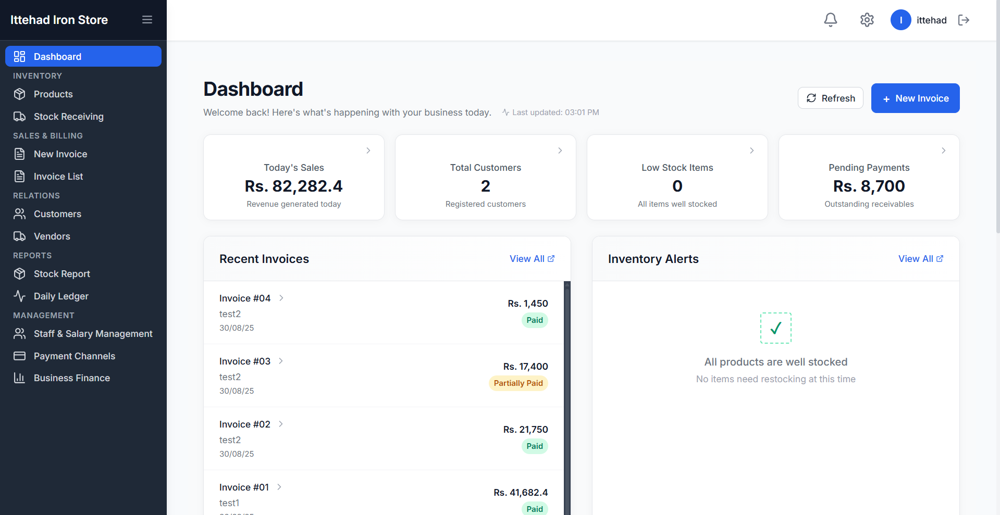
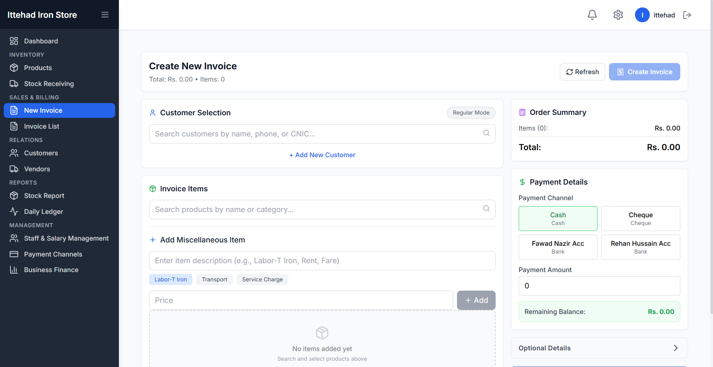
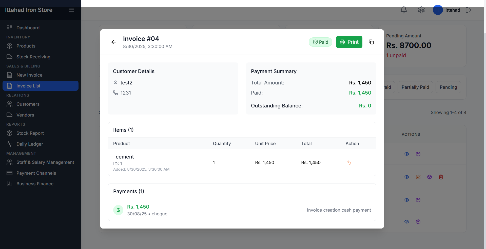
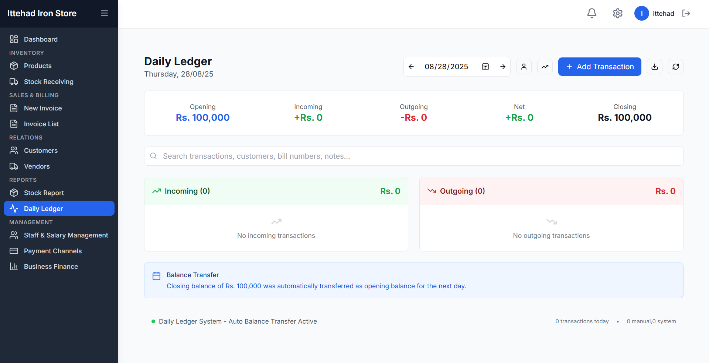
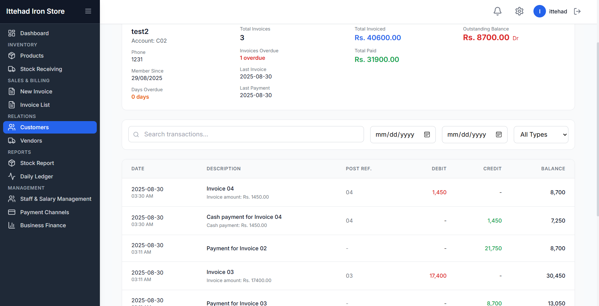
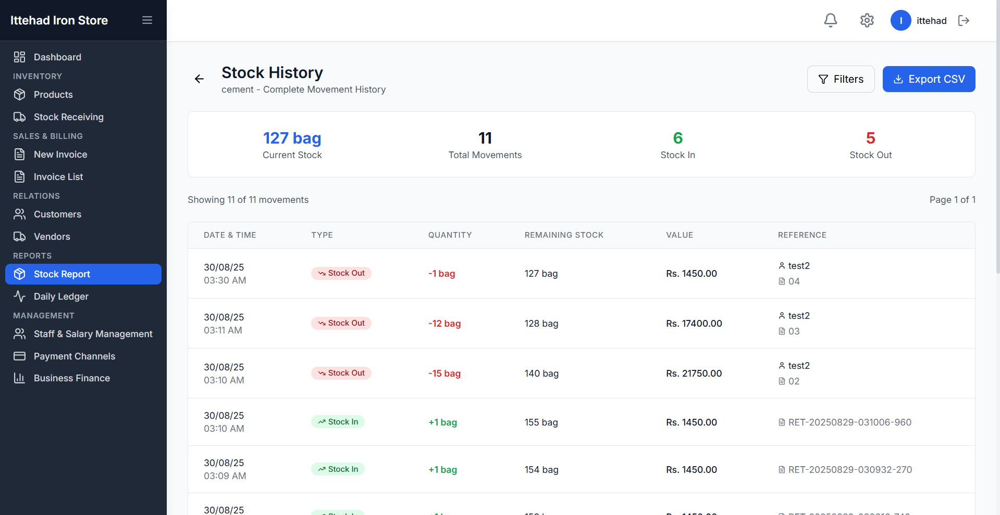

# Steel Store Management System

✨ **Ittehad IMS** is a modern desktop application designed to streamline business operations for hardware and iron stores. From inventory and billing to customer/vendor management and financial reporting, the system provides a complete solution in one secure, responsive interface.

## Project Overview

The aim of Ittehad IMS is to digitize manual business processes in small-to-medium hardware and iron shops. Traditionally, these businesses rely on paper-based systems that are error-prone and inefficient. This application replaces them with a robust, desktop-based system built with React, TypeScript, and Tauri, ensuring reliability, speed, and ease of use. This system was developed as a freelance project for a local hardware business, tailored to their operational needs.

Users can manage products, vendors, customers, invoices, and payments, while also monitoring stock and financial performance through an interactive dashboard.

## Screenshots
## Screenshots
  

## Features

- **Interactive Dashboard** – Track sales, stock alerts, revenue, and cash flow at a glance  
- **Inventory Management** – Add, update, and track products with unit management  
- **Billing & Sales** – Generate invoices with automated numbering and payment tracking  
- **Customer & Vendor Management** – Maintain ledgers, purchase history, and payment records  
- **Financial Reporting** – Daily ledger, profit/loss, and stock valuation reports  
- **Staff Module** – Record employees, track salaries, and manage roles  
- **Security & Backup** – Authentication, data encryption, and automatic database backup  

## Problem Statement

Many small and medium-sized iron and hardware stores still rely on manual registers or outdated software, leading to inefficiencies, human errors, and data loss risks. **Ittehad IMS** solves this by offering a reliable, all-in-one desktop management system that empowers store owners to make faster, data-driven decisions while reducing errors and saving time.

## Tech Stack

- **Frontend:** React 19, TypeScript, Tailwind CSS  
- **Desktop Framework:** Tauri (Rust-based, lightweight, secure)  
- **Database:** SQLite (fast, reliable, ACID-compliant)  
- **State Management:** Zustand  
- **Build Tool:** Vite  
- **Testing:** Vitest  

## Installation & Setup

1. Clone the Repository

git clone https://github.com/ataur-rehman/ittehad-iron-store.git

2. Install Dependencies

npm install

3. Start Development Server

npm run dev

4. Run with Tauri

npm run tauri dev

5. Build for Production

npm run tauri build

## 🌱 Future Enhancements

- Cloud sync for multi-branch stores
- Barcode scanner support for faster billing
- Mobile companion app for remote access

## 🙌 Acknowledgements

- Tauri community for enabling lightweight desktop apps
- React & TypeScript ecosystem for powerful development tools
- SQLite for a rock-solid embedded database

## 📬 Contact & Support

💼 GitHub: https://github.com/ataur-rehman  
📩 Email: ataurrehman3636@gmail.com  

⭐ If you like this project, consider giving it a star on GitHub! ⭐
